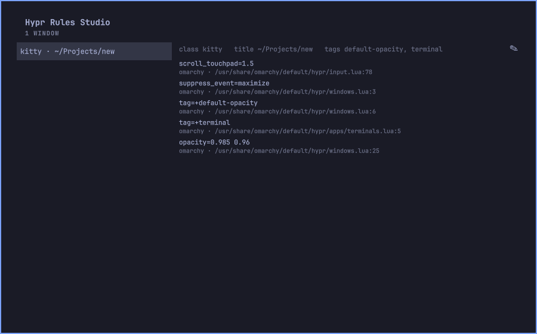

# Hypr Rules Studio

A bar plugin for [Omarchy](https://omarchy.org) that shows which Hyprland
window rules apply to a window and exactly where each one comes from, lets
you add your own without writing Lua, and tells you what is wrong when the
config does not load or a rule does not take effect.



## What it does

- **Explains a window.** Pick any open window and see, above the list, what
  you end up with — the final value of every property one of your rules
  touches, one row per property, each naming the `file:line` that set it
  last. Below that, every rule that applies to it, in the order your config
  applies them, each with a one-line summary of what it sets, where it comes
  from (`omarchy`, `theme`, `user` or `studio`), and the exact `file:line`
  that wrote it.
- **Warns you when it is guessing.** Hyprland rules can add and remove tags
  that later rules match on; the Inspector simulates that and tells you when
  the tags it worked out do not match what Hyprland itself reports. If your
  config does not load, or Hyprland itself cannot be reached, it says so
  plainly instead of showing an empty list.
- **Adds rules without touching Lua.** A form: what to match (class, title),
  what to change (float, pin, no focus, size, workspace, opacity). A **Test
  on this window** button applies the change once to the selected window
  through Hyprland's own Lua API — what it changes stays on the window until
  you change it back yourself or reload; nothing here is undone
  automatically.
- **Tells you what is broken.** The Doctor checks for a config that fails to
  load, errors Hyprland itself reports, rules you saved that are not actually
  loaded or that no longer match what is on disk, one of your rules getting
  overridden by a later one, and whether the trouble started right after a
  Hyprland update.
- **Warns from the bar.** The icon switches to its warning state the moment a
  health check turns unhealthy, so you find out from the bar instead of from
  a window misbehaving three days later. It checks once when the shell
  starts and again every time you open the panel.

## Install

```sh
omarchy plugin add https://github.com/FerC10110/omarchy-hypr-rules-studio --enable
```

To remove it:

```sh
omarchy plugin disable io.github.ferc10110.hypr-rules-studio
omarchy plugin remove io.github.ferc10110.hypr-rules-studio
```

## The Inspector

The left column lists every open window (`class · title`). Select one and the
right column fills in. "What you end up with" comes first: the final value of
every property a rule sets on this window, one row per property, each naming
the `file:line` that set it last — that is the one you would go fix. Below
it, every rule that applies to it, in the order your config applies them —
whichever rule sets a property last is the one that wins. Each entry shows
what it sets (`float=true size=1200x800`, for example), a `(maybe)` marker
when the rule uses something the Inspector cannot fully evaluate (a regex
Python cannot compile, or a Hyprland match field it does not model), and
underneath it, in a dimmer line, where it came from and the `file:line` that
wrote it.

Press the pencil (✎) to open the Editor with a new rule prefilled for the
selected window's class.

## The Editor

A plain form: **Class** and **Title** (both regexes, title optional) to match
on, and **Float**, **Pin**, **No focus** toggles plus **Size**, **Workspace**
and **Opacity** fields for what to change. Size accepts `1200x800`,
`1200X800` or `1200 x 800`; Opacity accepts one to three numbers
(`0.9`, `0.9 0.6`). **Test on this window** applies the change once, live, to
the window you had selected in the Inspector — nothing is written to disk by
this button, but what it changes on the window itself is *not* undone when
you close the panel or leave without saving; only reloading Hyprland
(`hyprctl reload`) or changing it back by hand restores it. **No focus** only
takes effect when a window first opens, so it is reported as skipped rather
than faked. **Save** writes the rule; **Cancel** discards the form.

**My rules**, above the form, lists what you have already saved. Select one
to load it into the form for editing, or press **Delete** to remove it.

## The Doctor

Opens automatically the moment a health check turns unhealthy (not on every
subsequent check, and never while you are mid-edit in the Editor), and is
always reachable by hand — the ⚕ icon at the top of the panel opens it from
any view, and Tab cycles Inspector → Editor → Doctor from the keyboard. It
reports, in order:

- your Hyprland config failing to load, with the file and line Lua reports;
- errors Hyprland itself is reporting through `hyprctl configerrors`;
- rules you saved that are not actually loaded (the `require` line is
  missing, or the generated file is gone) or that no longer match what you
  saved (`rules-studio.lua` was hand-edited, or the write was interrupted);
- one of your rules being overridden by a later rule that sets the same
  property, with the file and line of the rule that wins;
- and, if the config was healthy the last time it was checked and Hyprland's
  version has changed since, it says the trouble started right after that
  update instead of leaving you to guess.

**Check again** re-runs the checks. **See your windows anyway** goes back to
the Inspector without waiting for the config to be fixed — the pencil (✎)
still opens the Editor from there, and its **My rules** list still works even
while the config is broken, which is how you fix a rule that caused the
trouble in the first place. **Remove everything I wrote** (shown once you
have saved at least one rule, or if your saved rules could not even be read)
undoes everything this plugin has written, leaving the backup of your
Hyprland config in place.

## Applying a saved rule

Saving or deleting a rule regenerates `rules-studio.lua` immediately, but
Hyprland only re-reads it on `hyprctl reload` (or a Hyprland restart) — the
panel says as much in its notice after a save.

## What it writes

- `~/.config/hypr-rules-studio/rules.json` — your rules; the source of truth.
- `~/.config/hypr/rules-studio.lua` — generated from that file on every save
  or delete, inside a marked block (`-- >>> hypr-rules-studio (managed)` /
  `-- <<< hypr-rules-studio`). It is never parsed back; editing it by hand
  only lasts until the next save.
- One line, `require("hypr.rules-studio")`, appended to
  `~/.config/hypr/hyprland.lua` whenever it is missing (normally just once),
  so Hyprland loads the generated file.
- `~/.config/hypr/hyprland.lua.bak.<timestamp>` — a copy of your config taken
  each time the `require` line has to be added, not only the first time ever:
  purging and then saving a new rule adds it, and backs it up, again. The
  timestamp is nanosecond-resolution so two backups taken close together
  never collide on the filename. The Doctor's **Remove everything I wrote**
  takes one of these too, right before it rewrites the config.
- `~/.local/state/hypr-rules-studio/state.json` — the Hyprland version last
  seen at a healthy check, used to tell "this just broke" from "this broke
  right after an update".

Every one of these is written atomically (temp file, then rename). The
Doctor's **Remove everything I wrote** deletes `rules-studio.lua`, empties
`rules.json`, and removes the `require` line and its comment from
`hyprland.lua` — the `.bak.<timestamp>` copies are left where they are.

## Requirements

Omarchy 4.x, Hyprland 0.56 or newer with a Lua config (`hyprland.lua`, not
the older `hyprland.conf`) — the Editor's live preview relies on
`hyprctl eval`, which needs that version. It also shells out to `lua` to read
your config, which already ships as a dependency of `hyprland` itself.

## Development

```sh
python3 -m unittest discover -s tests -v
omarchy plugin validate .
```

`hyprctl` is faked throughout; `lua` is faked too, except for the tests that
run a real fixture config through the actual `lua` binary (`tests/fixtures/`)
to prove the config-reading step really works. No live Hyprland is needed to
run the suite.

## License

MIT
